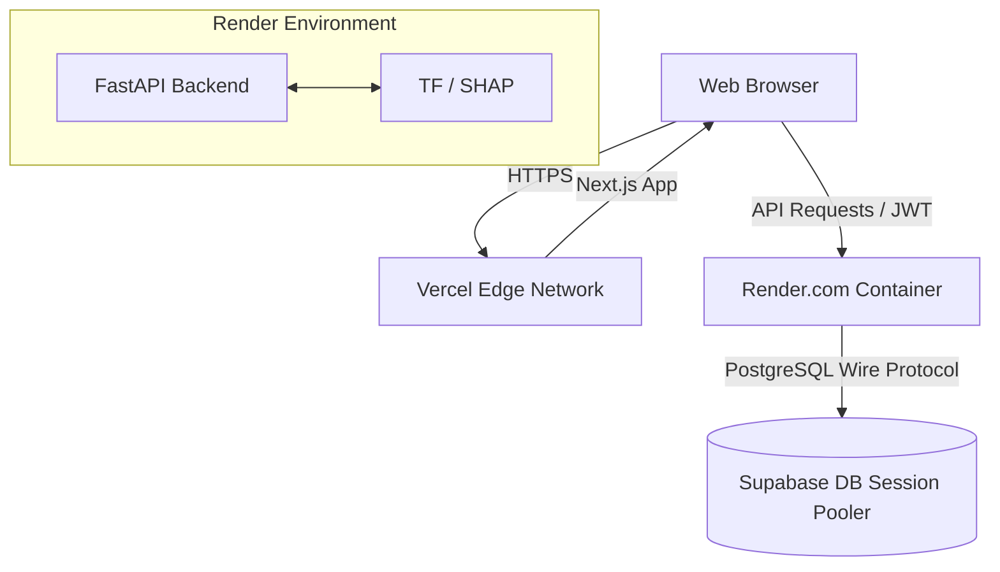

# Production Deployment Architecture

HealthFusion_FL utilizes a modern serverless and containerized architecture for deployment.

## Architecture Diagram

## 1. Database (Supabase)

The production database is hosted on Supabase PostgreSQL.
- **Connection:** Uses the IPv4 Session Pooler (port 5432) to support scalable serverless and container connections.
- **Security:** Password rotated and stored only in the Render dashboard.

## 2. Backend (Render)

The FastAPI backend is deployed on a Render Free Web Service using Docker.
- **Environment:** Python 3.12, Uvicorn, FastAPI.
- **Machine Learning:** The Docker container installs TensorFlow. Because Render free tier lacks GPUs, TensorFlow natively falls back to CPU execution. (The log `INTERNAL: CUDA error 303` is expected and non-blocking).
- **Environment Variables (Secrets):**
  - `DATABASE_URL`: Supabase connection string.
  - `JWT_SECRET_KEY`: High-entropy string for session tokens.
  - `CORS_ORIGINS`: Strictly `https://healthfusionflfrontend.vercel.app`.
  - `OPENROUTER_API_KEY`: Optional generative AI key.

## 3. Frontend (Vercel)

The Next.js 14 frontend is deployed on Vercel.
- **Environment Variables (Public):**
  - `NEXT_PUBLIC_API_BASE_URL`: `https://healthfusion-fl-backend.onrender.com`
  - `NEXT_PUBLIC_DEMO_MODE`: `false`
- **Security:** No backend secrets are exposed to Vercel. All requests are authenticated dynamically in the browser via `sessionStorage` JWTs.

## Rollback & Redeployment

- **Backend:** Pushes to the `main` branch trigger automated Render Docker builds. If a deployment fails, Render automatically aborts the rollout, keeping the previous container alive.
- **Frontend:** Vercel automatically creates preview deployments for Pull Requests. Pushes to `main` update the production alias.
