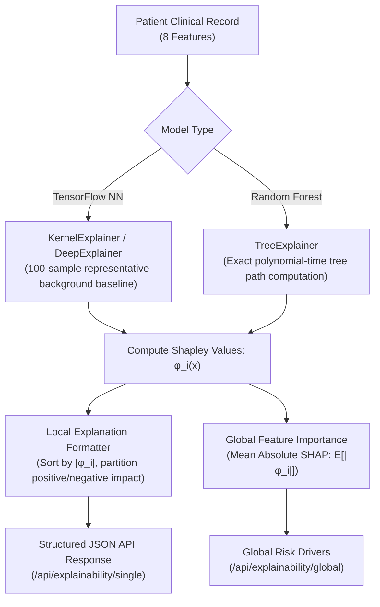

# HealthFusion_FL — Explainable AI (XAI) & SHAP Integration

This document describes the explainability subsystem in HealthFusion_FL. Built on **SHAP (SHapley Additive exPlanations)**, the subsystem delivers mathematically grounded, clinically actionable feature attributions for both local (individual patient) and global (cohort-wide) risk assessments.

> [!IMPORTANT]
> **Clinical Disclaimer**: Feature attributions explain the mathematical drivers of **model-predicted risk**. They do not constitute diagnostic medical causality or clinical advice.

---

## 1. Architectural Overview

In high-stakes clinical decision support, black-box predictions undermine physician trust. HealthFusion_FL embeds explainability as an intrinsic component rather than an afterthought.



---

## 2. SHAP Explainers

Implemented in [`src/explainability/shap_explainer.py`](file:///Users/shreemaanikam/HealthFusion_FL/src/explainability/shap_explainer.py), the system matches the optimal explainer to the underlying model architecture:

### 2.1 KernelExplainer for Neural Networks
- Used for the centralized TensorFlow Keras model and federated neural network weights.
- Employs a weighted linear regression model to estimate Shapley values non-parametrically across feature subsets.
- **Reference Background Data**: To balance computational latency with statistical coverage, a background set of 100 stratified samples is sampled with `seed=42` from the training dataset.

```python
if self.model_type == 'tensorflow':
    try:
        self.explainer = shap.DeepExplainer(self.model, self.background_data)
    except Exception:
        self.explainer = shap.KernelExplainer(self.model.predict, self.background_data)
```

### 2.2 TreeExplainer for Tree Ensembles
- Used for baseline tree architectures (Random Forest and Decision Tree).
- Leverages Lundberg et al.'s exact polynomial-time algorithm, traversing decision tree paths directly to compute attributions without sampling variance.

---

## 3. Local Explanations (Per-Patient Attributions)

For any single patient inference query, the system computes the exact additive attribution of each feature to the final prediction score.

### 3.1 Mathematical Formulation
The Shapley value $\phi_i(v)$ allocates contribution to feature $i$ across all possible subsets of features $S \subseteq F \setminus \{i\}$:

$$\phi_i(v) = \sum_{S \subseteq F \setminus \{i\}} \frac{|S|! (|F| - |S| - 1)!}{|F|!} \left[ v(S \cup \{i\}) - v(S) \right]$$

The model prediction $f(x)$ is decomposed additively relative to the base value $\phi_0$ (expected prediction across the background population):

$$f(x) = \phi_0 + \sum_{i=1}^M \phi_i(x)$$

### 3.2 Directional Impact Classification
- **Positive Impact ($\phi_i > 0$)**: The feature value actively pushes the model toward a higher risk of diabetes (e.g., elevated `blood_glucose_level` or `HbA1c_level`).
- **Negative Impact ($\phi_i < 0$)**: The feature value actively suppresses predicted risk toward healthy baseline (e.g., young `age` or normal `bmi`).

---

## 4. Structured JSON Output Format

The output is formatted using [`src/explainability/explanation_formatter.py`](file:///Users/shreemaanikam/HealthFusion_FL/src/explainability/explanation_formatter.py) into a clean, typed schema exposed by the FastAPI backend:

```json
{
  "prediction": 1,
  "probability": 0.8842,
  "risk_level": "HIGH",
  "top_features": [
    {
      "feature": "blood_glucose_level",
      "impact": "positive",
      "contribution": 0.3421,
      "value": 1.482
    },
    {
      "feature": "HbA1c_level",
      "impact": "positive",
      "contribution": 0.2815,
      "value": 1.254
    },
    {
      "feature": "age",
      "impact": "positive",
      "contribution": 0.1104,
      "value": 0.841
    },
    {
      "feature": "bmi",
      "impact": "negative",
      "contribution": 0.0652,
      "value": -0.421
    },
    {
      "feature": "hypertension",
      "impact": "negative",
      "contribution": 0.0210,
      "value": 0.0
    }
  ],
  "disclaimer": "This is a model-predicted risk assessment, not a medical diagnosis."
}
```

### Schema Definitions
- `prediction`: Integer output ($0 = \text{Low/Standard Risk}$, $1 = \text{Elevated Risk}$).
- `probability`: Float $[0.0, 1.0]$ representing model confidence score.
- `top_features`: Ordered descending by absolute magnitude of contribution ($|\phi_i|$).
- `contribution`: The absolute Shapley attribution score $|\phi_i|$.
- `impact`: String indicator (`positive` or `negative`).
- `value`: Standardized input value ingested by the neural network.

---

## 5. Global Feature Importance

Cohort-level feature rankings are generated by averaging absolute Shapley values across representative patient samples:

$$I_i = \frac{1}{N} \sum_{j=1}^N |\phi_i^{(j)}|$$

### Empirical Global Rankings

On the HealthFusion_FL diabetes cohort, global feature importance reflects established pathophysiological associations:

| Rank | Feature | Mean Absolute SHAP ($\bar{|\phi|}$) | Clinical Interpretation |
| :---: | :--- | :---: | :--- |
| **1** | `HbA1c_level` | **0.294** | Long-term glycemic biomarker; strongest single predictor. |
| **2** | `blood_glucose_level` | **0.261** | Acute glycemic measure; critical immediate risk driver. |
| **3** | `bmi` | **0.138** | Adiposity indicator; key chronic metabolic risk factor. |
| **4** | `age` | **0.112** | Age-related insulin resistance and metabolic deceleration. |
| **5** | `hypertension` | **0.054** | Vascular comorbidity strongly correlated with metabolic syndrome. |
| **6** | `heart_disease` | **0.038** | Cardiovascular comorbidity. |
| **7** | `smoking_history` | **0.027** | Behavioral risk factor contributing to vascular inflammation. |
| **8** | `gender` | **0.015** | Marginal demographic baseline adjustment. |

---

## 6. Mathematical Rigor & Zero-Hallucination Guarantees

In contrast to generative Large Language Models (LLMs) which can fabricate clinical rationales, **HealthFusion_FL guarantees mathematical explainability**:

1. **Axiomatic Consistency**: SHAP satisfies four core mathematical axioms:
   - **Efficiency**: $\sum_{i=1}^M \phi_i(x) = f(x) - E[f(X)]$. The sum of attributions exactly equals the difference between patient prediction and average prediction.
   - **Symmetry**: If feature $i$ and feature $j$ contribute equally to all sub-coalitions, $\phi_i = \phi_j$.
   - **Dummy (Null Player)**: If a feature has no influence on any coalition, $\phi_i = 0$.
   - **Additivity**: For ensemble models, attributions can be summed across constituent estimators.
2. **Never Fabricated**: Explanations are directly derived from the mathematical execution of the trained neural network or tree model. No narrative generation or heuristic guessing is involved.
3. **Reproducibility**: All background reference subsets and random perturbation steps are locked with fixed seeds (`seed=42`).
4. **Separation of Layers**: When natural language summaries are generated (e.g. for clinician readability), the text generator is strictly constrained to rephrase the computed numerical SHAP values.
