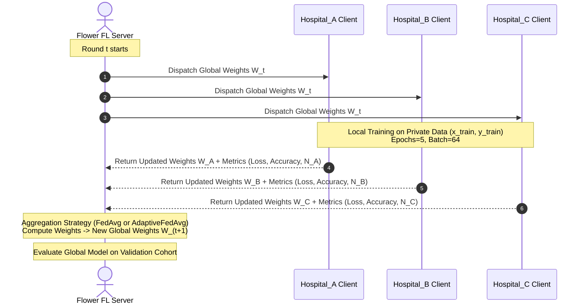
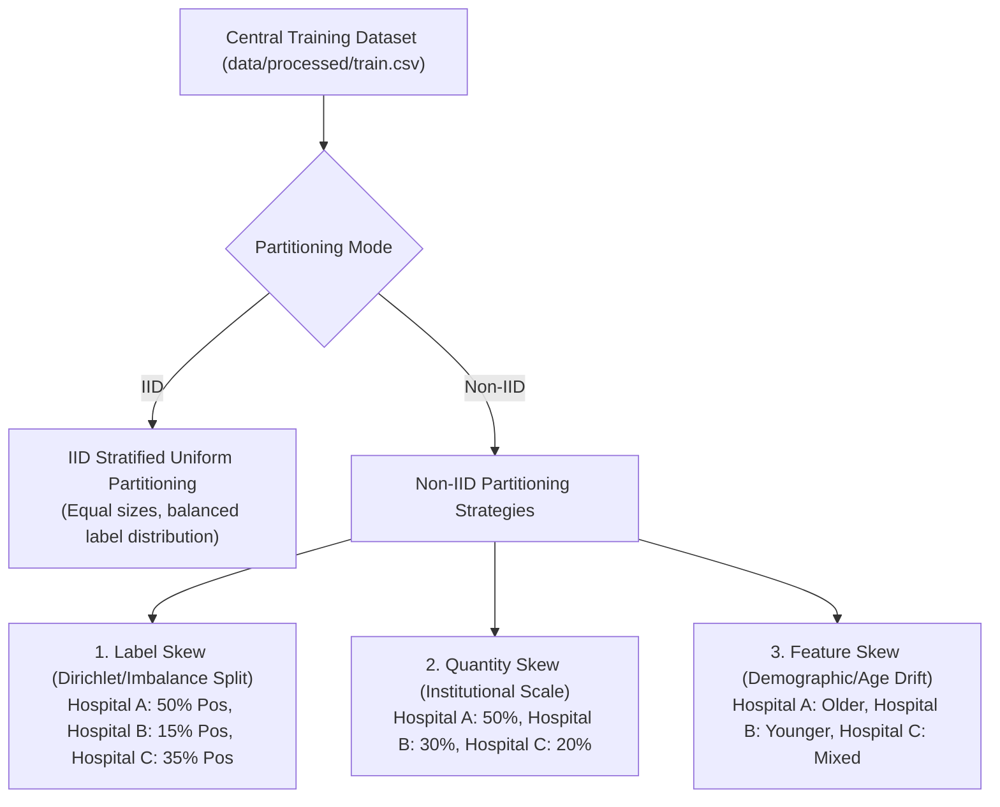

# HealthFusion_FL — Federated Learning Architecture & Orchestration

This document details the Federated Learning (FL) framework in HealthFusion_FL, built upon the **Flower (`flwr`)** library. The system enables distributed model training across distinct clinical entities without aggregating raw electronic health records into a central database.

> [!IMPORTANT]
> **Clinical Disclaimer**: Distributed federated models predict statistical risk patterns across decentralized cohorts. Outputs represent **model-predicted risk**, not confirmed clinical diagnoses.

---

## 1. System Architecture

HealthFusion_FL simulates a collaborative medical consortium comprising three participating hospital sites:
- **Hospital_A**
- **Hospital_B**
- **Hospital_C**



---

## 2. Partitioning Strategies

Real-world healthcare data is rarely distributed uniformly across institutions. HealthFusion_FL implements both **Independent and Identically Distributed (IID)** and realistic **Non-IID** data distribution mechanisms in [`src/federated/partitioning/`](file:///Users/shreemaanikam/HealthFusion_FL/src/federated/partitioning/).



### 2.1 IID Partitioning
Implemented in [`src/federated/partitioning/iid.py`](file:///Users/shreemaanikam/HealthFusion_FL/src/federated/partitioning/iid.py):
- The training cohort is shuffled randomly using `seed=42`.
- Uniform, stratified partitions of identical sample count and identical positive/negative label proportions are allocated to `Hospital_A`, `Hospital_B`, and `Hospital_C`.
- Provides an experimental control baseline to assess federated convergence under optimal statistical conditions.

### 2.2 Non-IID Partitioning
Implemented in [`src/federated/partitioning/non_iid.py`](file:///Users/shreemaanikam/HealthFusion_FL/src/federated/partitioning/non_iid.py):

| Strategy | Clinical Scenario | Partition Allocation Logic |
| :--- | :--- | :--- |
| **`label_skew`** | Specialized tertiary endocrinology clinic vs. general community clinic. | Positive diabetes cases are skewed: Hospital_A receives 50%, Hospital_C receives 35%, and Hospital_B receives 15%. Negative cases are distributed inversely (20% to A, 50% to B, 30% to C). Can also be parameterized via a Dirichlet distribution ($\alpha=0.5$). |
| **`quantity_skew`** | Large metropolitan academic hospital vs. rural regional health centers. | Hospital_A receives **50%** of total patient records, Hospital_B receives **30%**, and Hospital_C receives **20%**. |
| **`feature_skew`** | Geriatric hospital vs. pediatric or young-adult community clinic. | Divided by median age ($\sim 43$ years): Hospital_A receives 80% older cohort ($> \text{median}$), Hospital_B receives 80% younger cohort ($\le \text{median}$), and Hospital_C receives a mixed baseline. |

Partitions are saved to `data/federated/` to ensure full experimental reproducibility across rounds.

---

## 3. Client Architecture

The Flower client is implemented in [`src/federated/client.py`](file:///Users/shreemaanikam/HealthFusion_FL/src/federated/client.py) via `HealthFusionClient`, subclassing `flwr.client.NumPyClient`.

### 3.1 Key Lifecycle Methods
- **`get_parameters(config)`**: Serializes the local Keras neural network weights as a list of NumPy arrays to transmit to the server.
- **`fit(parameters, config)`**:
  1. Ingests current global parameters dispatched by the server: `model.set_weights(parameters)`.
  2. Extracts training configuration parameters (`epochs=5`, `batch_size=64`).
  3. Executes local gradient updates strictly on the client's private partition (`x_train`, `y_train`).
  4. Returns updated model weights, local sample count $N_k$, and performance metrics (`loss`, `client_id`).
- **`evaluate(parameters, config)`**: Evaluates candidate global weights on the client's internal validation cohort and returns `loss`, validation sample count, and `accuracy`.

```python
class HealthFusionClient(fl.client.NumPyClient):
    def __init__(self, client_id, train_data, val_data, model_fn, epochs=5, batch_size=64):
        self.client_id = client_id
        self.model = model_fn()
        self.x_train = train_data.drop(columns=['diabetes']).values
        self.y_train = train_data['diabetes'].values
        self.x_val = val_data.drop(columns=['diabetes']).values
        self.y_val = val_data['diabetes'].values
        self.epochs = epochs
        self.batch_size = batch_size
```

---

## 4. Aggregation Strategies

HealthFusion_FL supports two distinct aggregation paradigms:

### 4.1 Federated Averaging (FedAvg) Baseline
The canonical federated optimization algorithm by McMahan et al.:

$$W_{t+1} = \sum_{k=1}^K \frac{n_k}{N} W_t^k$$

Where:
- $K$ is the number of participating clients ($K = 3$).
- $n_k$ is the local sample count of client $k$.
- $N = \sum_{k=1}^K n_k$ is the total dataset volume across all active clients.
- $W_t^k$ represents the trained parameter weights of client $k$ in round $t$.

*Limitation*: While effective under IID data, FedAvg allows large or biased institutions to dominate model trajectory, and cannot penalize clients presenting noisy or overfitting updates.

### 4.2 Adaptive Federated Averaging (`AdaptiveFedAvg`)
Implemented in [`src/federated/strategy.py`](file:///Users/shreemaanikam/HealthFusion_FL/src/federated/strategy.py), this strategy overrides `aggregate_fit()` using a dynamic four-factor scoring function:

$$\text{Weight}_k = 0.4 \cdot \text{ValPerf}_k + 0.3 \cdot \text{SampleSize}_k + 0.2 \cdot \text{Stability}_k + 0.1 \cdot \text{Reliability}_k$$

- Bounded between $\text{min\_weight} = 0.1$ and $\text{max\_weight} = 0.6$.
- Renormalized such that $\sum_{k=1}^K w_k = 1.0$.
- Resilient against statistical drift, label skew, and institutional dominance.

---

## 5. Simulation Runner

Simulation execution is orchestrated by [`src/federated/runner.py`](file:///Users/shreemaanikam/HealthFusion_FL/src/federated/runner.py). It leverages `flwr.simulation.start_simulation` to manage multi-client execution within an optimized process pool.

### 5.1 Orchestration Workflow

```python
from src.federated.partitioning.config import PartitionConfig
from src.federated.partitioning.iid import partition_iid
from src.federated.partitioning.non_iid import partition_non_iid
from src.federated.client import HealthFusionClient
from src.federated.server import create_strategy
from src.federated.strategy import AdaptiveFedAvg
import flwr as fl

# 1. Load data & partition
config = PartitionConfig(num_clients=3, mode=mode, non_iid_strategy=non_iid_strategy)
partitions = partition_iid(train_data, config) if mode == 'iid' else partition_non_iid(train_data, config)

# 2. Define Client Factory
def client_fn(cid: str) -> fl.client.Client:
    idx = int(cid) % len(client_names)
    name = client_names[idx]
    return HealthFusionClient(client_id=name, train_data=partitions[name], val_data=test_data, model_fn=create_model)

# 3. Launch Simulation
history = fl.simulation.start_simulation(
    client_fn=client_fn,
    num_clients=3,
    config=fl.server.ServerConfig(num_rounds=5),
    strategy=strategy,
    client_resources={"num_cpus": 1, "num_gpus": 0},
)
```

---

## 6. Configuration & Environment Variables

The federated subsystem reads runtime configurations directly from `.env`:

| Variable | Default Value | Options / Constraints | Purpose |
| :--- | :---: | :--- | :--- |
| `FEDERATION_MODE` | `iid` | `iid`, `non_iid` | Governs client data distribution scheme |
| `FL_NUM_ROUNDS` | `5` | Positive Integer ($\ge 1$) | Number of global aggregation rounds |
| `FL_MIN_CLIENTS` | `3` | Positive Integer | Minimum available clients to trigger round |
| `FL_SERVER_ADDRESS` | `0.0.0.0:8080` | Host IP and Port | Network socket for physical gRPC server |
| `NON_IID_STRATEGY` | `label_skew` | `label_skew`, `quantity_skew`, `feature_skew` | Specific Non-IID skew profile |
| `MODEL_BATCH_SIZE` | `64` | Integer | Local training batch size |
| `MODEL_EPOCHS` | `5` | Integer | Local client training epochs per round |

---

## 7. How to Run

### 7.1 Execute Automated Federated Simulation

Run the complete comparative suite (IID and Non-IID across FedAvg and AdaptiveFedAvg):

```bash
python -m src.federated.runner
```

Output:
- Detailed round-by-round convergence metrics logged to stdout.
- Comprehensive JSON summary generated at [`reports/fl_experiment_results.json`](file:///Users/shreemaanikam/HealthFusion_FL/reports/fl_experiment_results.json).
- Adaptive weight telemetry logged to [`reports/adaptive_aggregation_metrics.json`](file:///Users/shreemaanikam/HealthFusion_FL/reports/adaptive_aggregation_metrics.json).

### 7.2 Run Distributed Physical Client/Server (Production Mode)

To start the Flower gRPC coordinating server:
```bash
python -m src.federated.server
```

To connect an independent hospital client node:
```bash
python -m src.federated.client --client-id Hospital_A --server 0.0.0.0:8080
```
