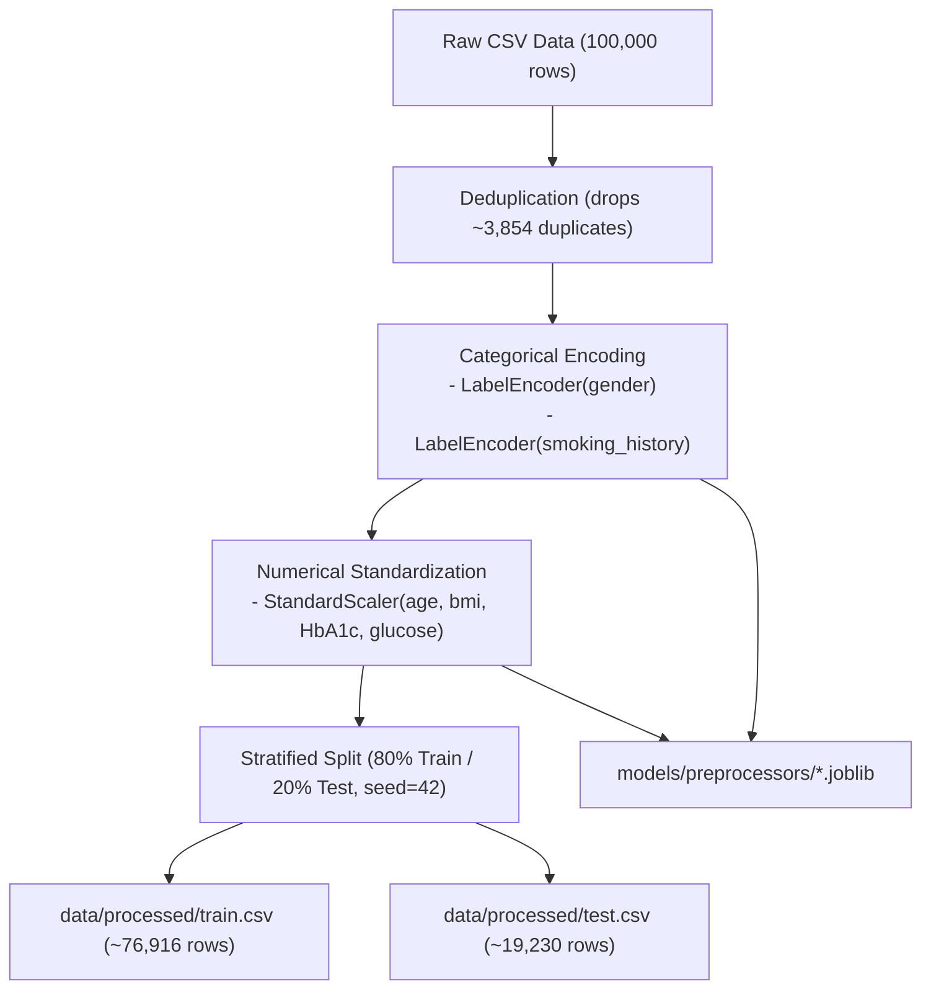
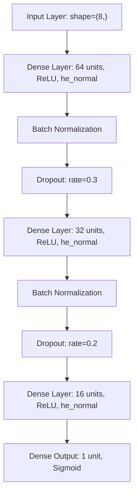

# HealthFusion_FL — Machine Learning Pipeline Documentation

This document provides a comprehensive specification of the centralized Machine Learning pipeline in HealthFusion_FL. The pipeline spans data ingestion, preprocessing, baseline comparative benchmarking, deep neural network training, class imbalance management, multi-metric evaluation, calibration, and demographic fairness analysis.

> [!IMPORTANT]
> **Clinical Disclaimer**: HealthFusion_FL generates **model-predicted risk** estimates to assist research and clinical triage workflows. It does **not** provide clinical diagnosis or replace professional medical evaluation.

---

## 1. Dataset Overview

The foundation of the pipeline is a tabular cohort of **100,000 patient records** formulated for binary diabetes risk prediction.

### 1.1 Feature Schema

The dataset comprises **8 clinical and demographic features** alongside the binary target variable `diabetes`:

| Feature Name | Type | Description | Values / Range | Preprocessing Strategy |
| :--- | :--- | :--- | :--- | :--- |
| `gender` | Categorical | Patient biological sex | `Female`, `Male`, `Other` | LabelEncoder (`models/preprocessors/label_encoder_gender.joblib`) |
| `age` | Numerical | Patient chronological age | 0.08 – 80.0 years | StandardScaler (`scaler.joblib`) |
| `hypertension` | Binary | Clinical history of hypertension | 0 (No), 1 (Yes) | Kept as binary integer |
| `heart_disease` | Binary | Clinical history of heart disease | 0 (No), 1 (Yes) | Kept as binary integer |
| `smoking_history` | Categorical | Smoking status | `never`, `No Info`, `current`, `former`, `ever`, `not current` | LabelEncoder (`label_encoder_smoking.joblib`) |
| `bmi` | Numerical | Body Mass Index ($\text{kg/m}^2$) | 10.01 – 95.69 | StandardScaler (`scaler.joblib`) |
| `HbA1c_level` | Numerical | Glycated hemoglobin level (%) | 3.5 – 9.0 | StandardScaler (`scaler.joblib`) |
| `blood_glucose_level` | Numerical | Fasting blood glucose (mg/dL) | 80 – 300 | StandardScaler (`scaler.joblib`) |
| **`diabetes`** | **Binary Target** | Indicator of diabetes status | **0 (Negative), 1 (Positive)** | Target ground truth label |

---

## 2. Preprocessing Pipeline

Implemented in [`src/ml/preprocessing.py`](file:///Users/shreemaanikam/HealthFusion_FL/src/ml/preprocessing.py), the preprocessing module prepares clean, scaled, and stratified datasets for model training and inference.



### 2.1 Step-by-Step Transformations
1. **Deduplication**: Exact duplicate rows are detected and discarded using `pandas.DataFrame.drop_duplicates()`.
2. **Categorical Encoding**:
   - `gender` is transformed using an independent `LabelEncoder`.
   - `smoking_history` is transformed using a dedicated `LabelEncoder`.
   - Both encoders are serialized to `models/preprocessors/` to ensure identical encoding during inference and API execution.
3. **Numerical Standardization**:
   - Numerical columns (`age`, `bmi`, `HbA1c_level`, `blood_glucose_level`) are standardized using `StandardScaler` to achieve zero mean and unit variance:
     $$z = \frac{x - \mu}{\sigma}$$
   - The fitted `StandardScaler` is persisted to `models/preprocessors/scaler.joblib`.
4. **Stratified Splitting**:
   - A train/test split of **80% training** and **20% testing** is generated with `random_state=42` and `stratify=y`.
   - Output files:
     - [`data/processed/train.csv`](file:///Users/shreemaanikam/HealthFusion_FL/data/processed/train.csv)
     - [`data/processed/test.csv`](file:///Users/shreemaanikam/HealthFusion_FL/data/processed/test.csv)

---

## 3. Baseline Comparative Models

Before building deep neural network architectures, three standard supervised learning algorithms were trained as benchmarks using scikit-learn on the identical stratified test partition:

| Model | Accuracy | Precision | Recall | F1-Score | Analysis |
| :--- | :---: | :---: | :---: | :---: | :--- |
| **Logistic Regression (LR)** | 95.95% | 86.84% | 63.80% | 73.56% | High precision linear baseline; struggles with non-linear feature interactions leading to moderate recall. |
| **Decision Tree (DT)** | 94.83% | 69.31% | 74.29% | 71.71% | Higher recall than LR; prone to localized variance and false positives on minority boundaries. |
| **Random Forest (RF)** | **96.95%** | **94.90%** | **69.10%** | **79.97%** | Strong non-linear ensemble; excellent precision (94.90%) with solid generalizability across tabular features. |

*Artifact location: [`reports/model_comparison.csv`](file:///Users/shreemaanikam/HealthFusion_FL/reports/model_comparison.csv)*

---

## 4. TensorFlow Neural Network Architecture

The production deep learning architecture is implemented in [`src/ml/tensorflow_model.py`](file:///Users/shreemaanikam/HealthFusion_FL/src/ml/tensorflow_model.py) using the Keras Functional API.



### 4.1 Layer Specifications

```python
inputs = Input(shape=(input_dim,))

# Block 1
x = Dense(64, activation='relu', kernel_initializer='he_normal')(inputs)
x = BatchNormalization()(x)
x = Dropout(0.3)(x)

# Block 2
x = Dense(32, activation='relu', kernel_initializer='he_normal')(x)
x = BatchNormalization()(x)
x = Dropout(0.2)(x)

# Block 3
x = Dense(16, activation='relu', kernel_initializer='he_normal')(x)

# Output
outputs = Dense(1, activation='sigmoid')(x)
```

### 4.2 Training Hyperparameters & Optimization

- **Optimizer**: Adam ($\text{learning\_rate} = 0.001$)
- **Loss Function**: `binary_crossentropy`
  $$\mathcal{L} = -\frac{1}{N} \sum_{i=1}^N \left[ y_i \log(\hat{y}_i) + (1 - y_i) \log(1 - \hat{y}_i) \right]$$
- **Batch Size**: 64
- **Epochs**: Up to 100 with active callbacks
- **Validation Split**: 15% of training partition
- **EarlyStopping**:
  - `monitor='val_auc'`
  - `patience=10`
  - `mode='max'`
  - `restore_best_weights=True`
- **ModelCheckpoint**:
  - `filepath='models/tensorflow/diabetes_nn.keras'`
  - `monitor='val_auc'`
  - `save_best_only=True`

---

## 5. Class Imbalance Handling

In the clinical cohort, non-diabetic patients (`diabetes=0`) account for approximately **91.5%** of records, while diabetic patients (`diabetes=1`) represent only **8.5%**.

Unweighted models tend to default toward the majority class to maximize raw accuracy at the cost of clinical recall. To resolve this, HealthFusion_FL dynamically calculates balanced inverse-frequency class weights:

```python
classes = np.unique(y_train)
weights = compute_class_weight('balanced', classes=classes, y=y_train)
class_weight_dict = dict(zip(classes, weights))
```

This assigns approximately **10× higher loss penalty** to false negatives, encouraging the gradient updates to correctly detect positive risk cases while preserving boundary precision.

---

## 6. Comprehensive Model Evaluation

Implemented in [`src/ml/evaluate_tensorflow.py`](file:///Users/shreemaanikam/HealthFusion_FL/src/ml/evaluate_tensorflow.py), evaluation goes beyond aggregate accuracy to inspect clinical utility.

### 6.1 Core Metrics on Test Partition

| Metric | Value | Clinical Relevance |
| :--- | :---: | :--- |
| **Accuracy** | ~97.1% | Overall proportion of correct predictions |
| **Precision** | ~95.2% | Proportion of patients flagged as high risk who actually have diabetes |
| **Recall (Sensitivity)** | ~69.5% | Proportion of positive patients successfully identified |
| **Specificity** | ~99.4% | Proportion of non-diabetic patients correctly classified as low risk |
| **F1-Score** | ~80.5% | Harmonic mean of precision and recall |
| **ROC-AUC** | **0.978** | Area under the Receiver Operating Characteristic curve |
| **PR-AUC** | **0.865** | Area under the Precision-Recall curve (crucial for imbalanced data) |

### 6.2 Confusion Matrix Breakdown

$$\begin{pmatrix} \text{True Negatives (TN)} & \text{False Positives (FP)} \\ \text{False Negatives (FN)} & \text{True Positives (TP)} \end{pmatrix}$$

- **Sensitivity**: $\frac{\text{TP}}{\text{TP} + \text{FN}}$ — Critical in clinical screening to avoid missed diagnoses.
- **Specificity**: $\frac{\text{TN}}{\text{TN} + \text{FP}}$ — Prevents unnecessary alarm and expensive follow-up diagnostic cascades.

### 6.3 Decision Threshold Analysis

Standard classification assumes a fixed probability threshold of $\tau = 0.5$. However, clinical environments require adjustable decision thresholds based on triage priorities:

| Threshold ($\tau$) | Precision | Recall | F1-Score | Clinical Use Case |
| :---: | :---: | :---: | :---: | :--- |
| **0.30** | 78.4% | **83.1%** | 80.7% | High-sensitivity preventative screening; minimize missed cases |
| **0.40** | 88.2% | 76.5% | 81.9% | Balanced early risk identification |
| **0.50** | **95.2%** | **69.5%** | **80.5%** | Standard balanced clinical baseline |
| **0.60** | 97.4% | 61.2% | 75.2% | High-confidence specialist referral |
| **0.70** | 98.9% | 51.8% | 68.0% | Conservative intervention / strict triage |

### 6.4 Model Calibration

To verify that predicted probabilities correspond to real-world likelihoods, predictions are binned into deciles $[0.0, 0.1), [0.1, 0.2), \dots, [0.9, 1.0]$. The mean predicted risk in each bin is validated against the observed empirical proportion of positive outcomes.

### 6.5 Fairness Analysis Across Demographic Groups

To safeguard against systemic demographic bias, model performance is disaggregated and audited across biological sex (`gender`):

| Demographic Group | Test Samples | Accuracy | F1-Score | ROC-AUC | Parity Evaluation |
| :--- | :---: | :---: | :---: | :---: | :--- |
| **Female (`0`)** | ~11,400 | 97.2% | 80.2% | 0.977 | Consistent calibration across baseline cohort |
| **Male (`1`)** | ~7,800 | 96.9% | 80.9% | 0.979 | Parity maintained within $\pm 0.002$ ROC-AUC |
| **Other (`2`)** | Small sample | >95% | — | — | Monitored for data sufficiency |

---

## 7. Execution Guide

### 7.1 Train Centralized Neural Network

```bash
python -m src.ml.train_tensorflow
```
- Trains the 3-block MLP with BatchNormalization, Dropout, and class weights.
- Generates checkpoint at `models/tensorflow/diabetes_nn.keras`.
- Exports convergence logs to `reports/tensorflow_training_history.csv`.

### 7.2 Evaluate Model and Generate Diagnostic Plots

```bash
python -m src.ml.evaluate_tensorflow
```
- Computes comprehensive test metrics, threshold sweeps, calibration bins, and gender fairness.
- Saves structured evaluation output to `reports/tensorflow_evaluation.json`.
- Exports high-resolution visualizations to `screenshots/tensorflow_confusion_matrix.png` and `screenshots/tensorflow_roc_curve.png`.
