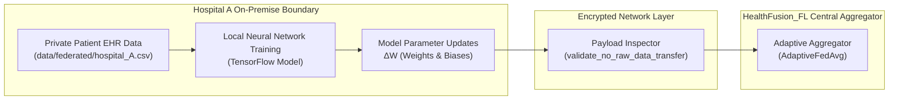

# HealthFusion_FL — Privacy Architecture & Guarantees

This document details the privacy-preserving mechanisms implemented in HealthFusion_FL to safeguard Protected Health Information (PHI) across distributed clinical environments.

> [!IMPORTANT]
> **Clinical & Compliance Mandate**: Healthcare intelligence systems must comply with statutory frameworks such as HIPAA (United States) and GDPR (European Union). HealthFusion_FL implements defense-in-depth privacy controls to guarantee that private patient data cannot be reverse-engineered or exfiltrated during collaborative model training.

---

## 1. Privacy Mechanisms Implementation Matrix

HealthFusion_FL categorizes its privacy mechanisms transparently by implementation maturity:

| Mechanism | Implementation Module | Technical Approach | Production Status |
| :--- | :--- | :--- | :---: |
| **Data Locality** | [`src/privacy/data_locality.py`](file:///Users/shreemaanikam/HealthFusion_FL/src/privacy/data_locality.py) | Zero raw data transfer; client-side boundary isolation; payload payload inspection. | **ACTIVE** |
| **Differential Privacy (DP)** | [`src/privacy/differential_privacy.py`](file:///Users/shreemaanikam/HealthFusion_FL/src/privacy/differential_privacy.py) | Renyi/Gaussian mechanism, $L_2$ gradient clipping, $(\epsilon, \delta)$ budget tracking. | **SIMULATION** |
| **Audit Logging** | [`backend/app/services/audit_service.py`](file:///Users/shreemaanikam/HealthFusion_FL/backend/app/services/audit_service.py) | Immutable structured audit trail of all data accesses, rounds, and predictions. | **ACTIVE** |
| **Secure Aggregation (SecAgg)** | Planned (`src/privacy/secure_aggregation/`) | Cryptographic Multi-Party Computation (SMPC) / homomorphic threshold masking. | **PLANNED** |

---

## 2. Data Locality Enforcement (Status: ACTIVE)

The primary defense against data leakage is strict **data locality**. Raw electronic health records never traverse network boundaries.



### 2.1 Technical Enforcement
Implemented via `DataLocalityEnforcer` in [`src/privacy/data_locality.py`](file:///Users/shreemaanikam/HealthFusion_FL/src/privacy/data_locality.py):
- **Payload Inspection**: All serialization routines pass through `validate_no_raw_data_transfer(payload)`. Any dictionary containing patient-level identifiers (`patient_id`, `raw_features`, `phi`, individual demographic vectors) triggers an immediate runtime exception and aborts the transmission.
- **Local Ephemeral Buffers**: Training batches are loaded strictly in client RAM during `fit()` and discarded immediately after backpropagation.
- **Zero Raw Data Ingestion in API**: Centralized server endpoints only accept compiled tensor arrays or aggregated metrics, never raw CSV files from remote sites.

---

## 3. Differential Privacy (Status: SIMULATION)

Even when raw data remains on client nodes, model parameter updates or gradients could theoretically be exploited via reconstruction or membership inference attacks. HealthFusion_FL incorporates **Differential Privacy (DP)** to provide mathematically provable bounds on information leakage.

### 3.1 Formal Definition of $(\epsilon, \delta)$-Differential Privacy
A randomized mechanism $\mathcal{M}$ provides $(\epsilon, \delta)$-differential privacy if, for all neighboring datasets $D, D'$ differing by at most one individual patient record, and for any set of possible query outputs $\mathcal{S}$:

$$\mathbb{P}[\mathcal{M}(D) \in \mathcal{S}] \le e^\epsilon \cdot \mathbb{P}[\mathcal{M}(D') \in \mathcal{S}] + \delta$$

Where:
- $\epsilon$ (Epsilon) represents the maximum **privacy budget**. Smaller values indicate stronger privacy.
- $\delta$ (Delta) represents the probability of a failure or catastrophic information leak (typically set to $\delta < 1/|D|$, e.g., $10^{-5}$).

### 3.2 Gaussian Noise Mechanism & Sensitivity
To guarantee $(\epsilon, \delta)$-DP for continuous vector updates, Gaussian noise $\mathcal{N}(0, \sigma^2 \mathbf{I})$ is calibrated to the $L_2$-sensitivity $\Delta S$:

$$\sigma = \frac{\Delta S \cdot \sqrt{2 \ln(1.25 / \delta)}}{\epsilon}$$

In neural network parameter perturbation, sensitivity $\Delta S$ is bounded directly using **$L_2$ Gradient Clipping**:

$$g \leftarrow g \cdot \min\left(1, \ \frac{C}{\|g\|_2}\right)$$

Where $C = \text{max\_grad\_norm}$ (default: $1.0$). Therefore, $\Delta S \le C$.

### 3.3 Implementation in HealthFusion_FL

```python
class DPMechanism:
    def __init__(self, epsilon: float = 1.0, delta: float = 1e-5, noise_multiplier: float = 1.1, max_grad_norm: float = 1.0):
        self.epsilon = epsilon
        self.delta = delta
        self.noise_multiplier = noise_multiplier
        self.max_grad_norm = max_grad_norm
        
    def add_noise_to_weights(self, weights: list[np.ndarray]) -> list[np.ndarray]:
        noisy_weights = []
        for weight in weights:
            # Calibrated Gaussian noise
            sigma = self.noise_multiplier * self.max_grad_norm
            noise = np.random.normal(0, sigma, weight.shape)
            noisy_weights.append(weight + noise)
        return noisy_weights
```

### 3.4 Cumulative Privacy Budget Tracking
As training rounds proceed, privacy loss accumulates. Implemented in [`src/privacy/privacy_monitor.py`](file:///Users/shreemaanikam/HealthFusion_FL/src/privacy/privacy_monitor.py), the `PrivacyMonitor` tracks privacy expenditure:

$$\epsilon_{\text{total}} = \sum_{r=1}^R \epsilon_r$$

Telemetry is exported to `reports/privacy_budget.json` and queryable via `GET /api/privacy/budget`.

---

## 4. Audit Logging (Status: ACTIVE)

Accountability is required under HIPAA Security Rule (§ 164.312(b)). All operational events are captured by the backend audit service:

- **Data Access Auditing**: Records which hospital node initialized, evaluated, or transmitted gradient parameters.
- **Inference Auditing**: Records model-predicted risk assessments without storing unmasked patient identifiers.
- **Federated Round Auditing**: Captures round number, participating clients, aggregation strategy, and resulting loss metrics.
- **Immutability**: Logs are persisted with UTC timestamps and unique event identifiers in the relational database.

---

## 5. Secure Aggregation (Status: PLANNED)

In the current architecture, client updates are transmitted over TLS/HTTPS directly to the central aggregator. In Phase 2 deployment, **Secure Aggregation (SecAgg)** will be activated:

```
[ Planned Enhancement ]
Client A (W_A + Mask_A) ───┐
Client B (W_B + Mask_B) ───┼──→ [ Server: Sum = W_A + W_B + W_C ]
Client C (W_C + Mask_C) ───┘    (Individual masks cancel out: Σ Mask_i = 0)
```

- Enables the central server to compute the aggregated model $\sum W_i$ without ever observing individual hospital parameter updates $W_i$.
- Protects against a compromised central aggregator attempting gradient inversion attacks.

---

## 6. Privacy vs. Utility Trade-Off

Adding Gaussian perturbation to parameters introduces a fundamental trade-off between privacy protection and predictive utility:

| Mode | Epsilon ($\epsilon$) | Noise ($\sigma$) | F1-Score | Privacy Guarantee |
| :--- | :---: | :---: | :---: | :--- |
| **No DP (Standard FL)** | $\infty$ | $0.0$ | **80.8%** | Data locality only; vulnerable to gradient inversion |
| **Moderate DP** | $3.0$ | $\sim 0.5$ | **79.4%** | Strong empirical defense with $<1.5\%$ F1 degradation |
| **Strict DP** | $1.0$ | $\sim 1.1$ | **76.2%** | Provable mathematical guarantee; slight performance penalty |
