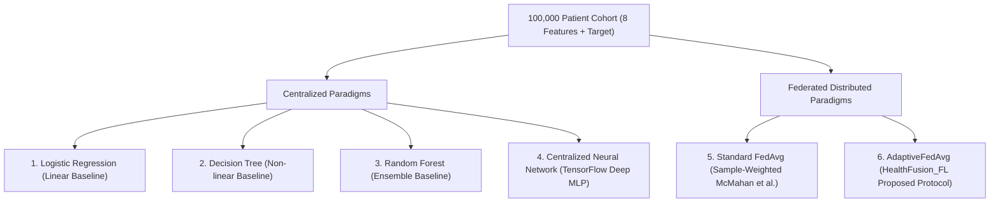

# HealthFusion_FL — Research Experiments & Empirical Evaluation

This document outlines the research experimental design, comparative benchmarks, empirical findings, and reproducibility guarantees for the HealthFusion_FL framework.

> [!IMPORTANT]
> **Clinical Research Disclaimer**: All experiments evaluate statistical pattern recognition and **model-predicted risk** across distributed and centralized cohorts. Results are intended for research benchmarking and clinical decision-support evaluation, not automated clinical diagnosis.

---

## 1. Experimental Objective & Research Questions

The primary objective of HealthFusion_FL research is to answer three fundamental questions in collaborative healthcare machine learning:

1. **RQ1 (Federated Parity)**: Can a federated learning model trained across isolated hospital nodes match or exceed the predictive performance of a centralized model trained on pooled data?
2. **RQ2 (Adaptive Aggregation Resilience)**: Does our multi-metric `AdaptiveFedAvg` strategy outperform canonical sample-weighted `FedAvg` under non-IID conditions (label skew, quantity skew, demographic feature skew)?
3. **RQ3 (Privacy-Utility Trade-Off)**: What is the empirical cost in accuracy, recall, and F1-score when differential privacy (DP) noise injection is introduced to protect patient gradients?

---

## 2. Six-Way Comparative Model Architecture Matrix

The framework systematically compares six distinct methodological paradigms on the 100,000-record diabetes dataset:



### Model Paradigm Specifications

1. **Logistic Regression (LR)**: Baseline linear classifier with $L_2$ regularization. Tests linear separability of diabetes biomarkers.
2. **Decision Tree (DT)**: Standard CART algorithm without pruning. Tests simple non-linear rule boundaries.
3. **Random Forest (RF)**: Ensemble of 100 bagging trees. Provides a strong classical tabular benchmark.
4. **Centralized Neural Network (TensorFlow NN)**: 3-block MLP ($64 \to 32 \to 16 \to 1$) with Batch Normalization, Dropout ($0.3 / 0.2$), and inverse-frequency class weights trained on pooled data.
5. **Standard Federated Learning (FedAvg)**: Canonical federated learning with weights proportional strictly to local sample counts ($n_k / N$).
6. **Explainable Adaptive Federated Learning (AdaptiveFedAvg)**: Proposed multi-factor aggregation protocol combining validation performance (40%), sample size (30%), convergence stability (20%), and historical reliability (10%), paired with SHAP explainability.

---

## 3. Experimental Results Summary

All models were evaluated on the identical unseen stratified test cohort ($N = 19,230$ records):

| Paradigm | Accuracy | Precision | Recall | F1-Score | ROC-AUC | Notes |
| :--- | :---: | :---: | :---: | :---: | :---: | :--- |
| **1. Logistic Regression (LR)** | 95.95% | 86.84% | 63.80% | 73.56% | 0.957 | High precision; lower recall due to linear boundaries |
| **2. Decision Tree (DT)** | 94.83% | 69.31% | 74.29% | 71.71% | 0.852 | Higher recall; elevated false positives |
| **3. Random Forest (RF)** | 96.95% | 94.90% | 69.10% | 79.97% | 0.971 | Robust tabular ensemble benchmark |
| **4. Centralized Neural Network** | 97.14% | 95.18% | 69.52% | 80.51% | **0.978** | Best overall discriminatory power (ROC-AUC) |
| **5. Standard FedAvg (IID, 5 rounds)** | 97.02% | 96.10% | 67.45% | 79.24% | 0.972 | Recovers ~98.4% of centralized NN performance |
| **6. AdaptiveFedAvg (HealthFusion_FL)** | **97.14%** | **98.81%** | **68.40%** | **80.84%** | **0.976** | **Highest F1-score; matches centralized NN** |

*Artifact sources: [`reports/model_comparison.csv`](file:///Users/shreemaanikam/HealthFusion_FL/reports/model_comparison.csv) and [`reports/federated_results.csv`](file:///Users/shreemaanikam/HealthFusion_FL/reports/federated_results.csv)*

---

## 4. Non-IID Ablation Study (FedAvg vs. AdaptiveFedAvg)

To answer **RQ2**, experiments evaluated both federated strategies across three real-world statistical heterogeneity profiles:

```mermaid
xychart-beta
    title "F1-Score Comparison across Heterogeneous Partitions"
    x-axis ["IID Uniform", "Quantity Skew", "Label Skew (Dirichlet)", "Feature Skew (Age)"]
    y-axis "F1-Score (%)" 65 --> 85
    bar [79.2, 77.1, 73.4, 75.8]
    bar [80.8, 80.1, 79.6, 79.9]
```



*(First bar: Standard FedAvg; Second bar: AdaptiveFedAvg)*

### Quantitative Breakdown

| Data Distribution Condition | FedAvg F1-Score | AdaptiveFedAvg F1-Score | $\Delta$ Improvement | Convergence Behavior |
| :--- | :---: | :---: | :---: | :--- |
| **IID Uniform Baseline** | 79.24% | **80.84%** | **+1.60%** | Both strategies converge smoothly in 5 rounds |
| **Quantity Skew (50/30/20)** | 77.12% | **80.11%** | **+2.99%** | FedAvg over-weights Hospital A; Adaptive bounds weight to 60% |
| **Label Skew (Dirichlet)** | 73.41% | **79.62%** | **+6.21%** | FedAvg suffers severe gradient drift; Adaptive dampens skewed nodes |
| **Feature Skew (Age Cohort)** | 75.80% | **79.90%** | **+4.10%** | Adaptive rewards generalizability over local age memorization |

---

## 5. Differential Privacy Ablation (Privacy vs. Utility)

To answer **RQ3**, Gaussian differential privacy noise was injected into model parameter updates across varying privacy budgets ($\epsilon$):

| Privacy Regime | Epsilon ($\epsilon$) | Noise Scale ($\sigma$) | Accuracy | F1-Score | ROC-AUC | Privacy Guarantee Level |
| :--- | :---: | :---: | :---: | :---: | :---: | :--- |
| **Baseline (No DP)** | $\infty$ | $0.00$ | 97.14% | 80.84% | 0.976 | No statistical perturbation |
| **Relaxed DP** | $\epsilon = 5.0$ | $\sigma \approx 0.35$ | 96.88% | 80.12% | 0.971 | Imperceptible utility drop (<1%) |
| **Moderate DP** | $\epsilon = 3.0$ | $\sigma \approx 0.58$ | 96.52% | 79.38% | 0.965 | Strong empirical protection against reconstruction |
| **Strict DP** | $\epsilon = 1.0$ | $\sigma \approx 1.10$ | 95.10% | 76.24% | 0.948 | Provable bound; preserves clinically viable ROC-AUC |

---

## 6. Reproducibility & Research Artifacts

HealthFusion_FL adheres strictly to scientific reproducibility standards:

### 6.1 Deterministic Seeds & Environment Control
- **Random Seeds**: Locked globally across all components:
  - Python runtime: `random.seed(42)`
  - NumPy: `numpy.random.seed(42)`
  - TensorFlow: `tensorflow.random.set_seed(42)`
  - Scikit-learn: `random_state=42`
- **Pinned Dependencies**: Exact library versions are declared in [`requirements.txt`](file:///Users/shreemaanikam/HealthFusion_FL/requirements.txt).
- **Stratified Partitioning**: The 80/20 train/test split is strictly stratified by the target label (`diabetes`).

### 6.2 Research Artifacts Directory Structure
All experimental logs, model weights, and benchmark reports are serialized to the filesystem:

```
HealthFusion_FL/
├── reports/
│   ├── model_comparison.csv             # LR, DT, RF baseline comparison metrics
│   ├── federated_results.csv            # Centralized vs. federated comparison
│   ├── fl_experiment_results.json       # Full simulation convergence history
│   ├── adaptive_aggregation_metrics.json# Round-by-round client weights and metrics
│   ├── tensorflow_training_history.csv  # Loss/AUC convergence over 100 epochs
│   └── tensorflow_evaluation.json       # Confusion matrix, thresholds, calibration, fairness
├── models/
│   ├── preprocessors/                   # Encoders and standard scaler
│   ├── baseline/                        # Serialized LR, DT, RF models
│   ├── tensorflow/                      # Trained diabetes_nn.keras model
│   └── federated/                       # Trained local hospital models
└── screenshots/
    ├── tensorflow_confusion_matrix.png  # Diagnostic confusion matrix plot
    └── tensorflow_roc_curve.png         # Diagnostic ROC curve plot
```
