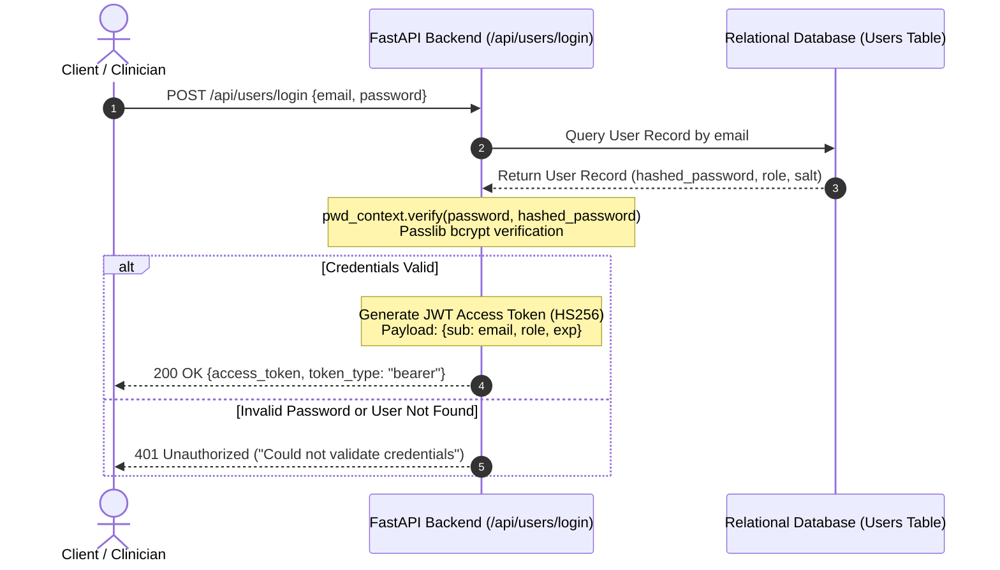

# HealthFusion_FL — Security & Access Control Architecture

This document details the security architecture, authentication mechanisms, authorization controls, and data protection practices governing HealthFusion_FL.

> [!IMPORTANT]
> **Clinical Security Imperative**: Healthcare systems handle sensitive institutional and clinical metadata. HealthFusion_FL enforces zero-trust design, role-based isolation, strict schema validation, and secure secrets handling across all runtime services.

---

## 1. Zero Secrets in Code & Configuration Management

HealthFusion_FL strictly enforces the separation of codebase and runtime credentials according to Twelve-Factor App principles:

1. **Environment Variables**: All configuration parameters, keys, and connection strings are managed via `.env` files parsed using Pydantic's `BaseSettings` in [`backend/app/config.py`](file:///Users/shreemaanikam/HealthFusion_FL/backend/app/config.py).
2. **Version Control Exclusion**: `.env` and all credential artifacts (`*.key`, `*.pem`, `*.db`) are explicitly ignored in `.gitignore`.
3. **Template Distribution**: A sanitized template [`/.env.example`](file:///Users/shreemaanikam/HealthFusion_FL/.env.example) is committed to the repository, containing dummy placeholders and clear variable descriptions.

---

## 2. Authentication & Cryptography

Authentication is implemented in [`backend/app/core/security.py`](file:///Users/shreemaanikam/HealthFusion_FL/backend/app/core/security.py) using industry-standard cryptographic algorithms:



### 2.1 Password Hashing with Bcrypt
Passwords are never stored in plaintext. They are salted and hashed using `passlib.context.CryptContext` with the `bcrypt` algorithm:
```python
pwd_context = CryptContext(schemes=["bcrypt"], deprecated="auto")
```

### 2.2 JWT Token Generation & Validation
- **Algorithm**: HMAC-SHA256 (`HS256`)
- **Key**: Configurable via `JWT_SECRET_KEY` in environment variables.
- **Expiration**: Enforced via `JWT_ACCESS_TOKEN_EXPIRE_MINUTES` (default: 60 minutes).
- **Transport**: Standard HTTP `Authorization: Bearer <token>` header.

---

## 3. Role-Based Access Control (RBAC)

HealthFusion_FL enforces four distinct clinical and administrative roles via the `RoleEnum`:

| Role | Permitted Actions | Prohibited Actions |
| :--- | :--- | :--- |
| **`DOCTOR`** | - Ingest patient features for risk prediction (`POST /api/prediction/predict`)<br/>- Request SHAP feature attributions (`POST /api/explainability/single`)<br/>- View clinical summary reports (`GET /api/reports/{id}`) | - Start or configure federated rounds<br/>- Access raw client node telemetry<br/>- Create users or modify organizations |
| **`HOSPITAL_ADMIN`** | - Manage local hospital node registration (`GET/POST /api/organizations`)<br/>- View local data locality and client access logs (`GET /api/privacy/status`)<br/>- Inspect institutional participation history | - Execute cross-institution federated training commands<br/>- Modify global system policies |
| **`RESEARCHER`** | - View global model performance benchmarks (`GET /api/models`)<br/>- Trigger simulated federated experiments (`POST /api/federated/simulation`)<br/>- Inspect global feature importance aggregations | - Access individual patient prediction logs<br/>- Modify user credentials or organization settings |
| **`SYSTEM_ADMIN`** | - Full administrative privileges<br/>- User provisioning & role assignment (`POST /api/users`)<br/>- System configuration, database migrations, and audit monitoring | — |

### 3.1 Backend Route Authorization Enforcement
Route authorization is applied declaratively using FastAPI dependency injection via the `require_role()` higher-order function:

```python
def require_role(*roles: RoleEnum):
    async def role_checker(current_user = Depends(get_current_user)):
        if current_user.role not in [role.value for role in roles]:
            raise HTTPException(
                status_code=status.HTTP_403_FORBIDDEN, 
                detail="Not enough privileges"
            )
        return current_user
    return role_checker

# Example usage in FastAPI route
@router.post("/federated/start-round")
async def start_round(current_user: User = Depends(require_role(RoleEnum.SYSTEM_ADMIN))):
    ...
```

---

## 4. Input Validation & Data Sanitization

All incoming requests are validated against strict Pydantic schemas in [`backend/app/schemas/schemas.py`](file:///Users/shreemaanikam/HealthFusion_FL/backend/app/schemas/schemas.py):

- **Data Typing & Bounds**: Fields like `age` (0.0 to 120.0), `bmi` (10.0 to 100.0), `HbA1c_level` (3.0 to 20.0), and `blood_glucose_level` (40.0 to 500.0) are strictly validated.
- **SQL Injection Prevention**: The application exclusively interacts with databases through SQLAlchemy's parameterized queries and Object Relational Mapping (ORM). Raw SQL string concatenation is prohibited.
- **Payload Size Limits**: Request body limits prevent Denial-of-Service (DoS) buffer exhaustion attacks.

---

## 5. Network Security & HTTP Headers

### 5.1 Cross-Origin Resource Sharing (CORS) Whitelist
CORS is explicitly configured in [`backend/app/main.py`](file:///Users/shreemaanikam/HealthFusion_FL/backend/app/main.py). In production, wildcard origins (`"*"`) are disallowed, restricting access strictly to validated frontend domain origins:

```python
app.add_middleware(
    CORSMiddleware,
    allow_origins=[origin.strip() for origin in settings.CORS_ORIGINS.split(",")],
    allow_credentials=True,
    allow_methods=["GET", "POST", "PUT", "DELETE"],
    allow_headers=["Authorization", "Content-Type"],
)
```

### 5.2 Mandatory Security Headers
Every HTTP response issued by the backend includes defensive security headers applied via custom ASGI middleware:
- **`X-Content-Type-Options: nosniff`**: Prevents MIME-type sniffing attacks.
- **`X-Frame-Options: DENY`**: Mitigates clickjacking and embedding inside unauthorized iframes.

---

## 6. Safe Error Handling & Production Hygiene

1. **Information Leakage Prevention**: Production instances must set `DEBUG=false` in `.env`. Stack traces, internal memory addresses, and database schema errors are captured in server-side logs and never returned to client consumers.
2. **Sanitized Structured Logging**: All application logs use JSON formatting via [`backend/app/core/logging_config.py`](file:///Users/shreemaanikam/HealthFusion_FL/backend/app/core/logging_config.py). Authentication passwords, JWT secrets, and Protected Health Information are explicitly stripped prior to log emission.
3. **Safe Error Payloads**: Unhandled exceptions return generic, standardized error payloads:
   ```json
   {
     "detail": "An internal server error occurred. Please contact the system administrator."
   }
   ```
